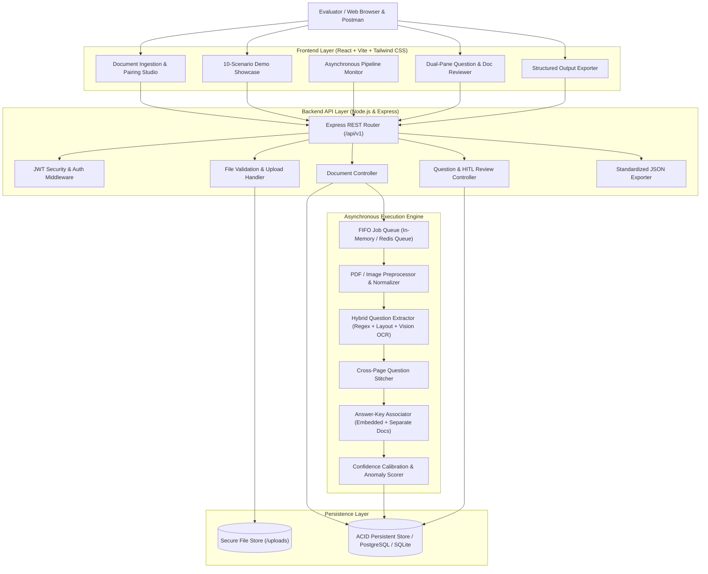
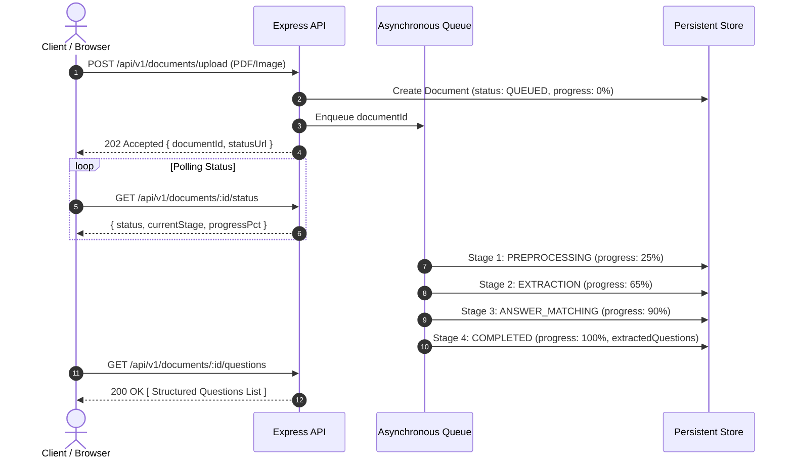

# Architecture & Technical Design Document

**Pragati Bharati — Document Intelligence & Question Extraction Service**  
*Full Stack Developer Assessment — Round 2*

---

## 1. Executive Summary
This system is an enterprise-grade, asynchronous Document Intelligence & Question Extraction platform designed to ingest complex examination materials (digitally generated PDFs, scanned low-resolution papers, single/multi-page images) and convert them into structured, system-independent, machine-readable question banks with automated answer-key association, confidence calibration, and human-in-the-loop review capabilities.

---

## 2. Overall Architecture

---

## 3. Document-Processing Approach
The platform handles diverse, imperfect, and heterogeneous inputs across two major ingest pipelines:

1. **Digital PDFs**:
   - Uses low-level stream parsing to capture text coordinates and font markers per page.
   - Preserves exact page-level boundaries to allow granular page-to-question attribution (`source_pages: [1, 2]`).
2. **Scanned Documents & Images (JPG, PNG, Low-Res Scans)**:
   - Evaluates text density. If a PDF has no selectable text layer or if an image is provided, the ingestion routes to the **Adaptive Vision OCR Engine**.
   - Handles low-contrast noise, rotated pages, and irregular option layouts without failing.
3. **Multi-Page Question Stitching**:
   - The engine tracks open question states across page boundaries.
   - If a question prompt begins at the bottom of Page $N$ and option sets continue onto Page $N+1$, the parser merges the AST nodes and sets `source_pages: [N, N+1]`.

---

## 4. OCR & AI Technology Choices
- **Dual Engine Architecture**:
  1. **Built-in Adaptive Layout & Structural Parser**: Pure Node.js regex and AST segmenter for ultra-fast, zero-dependency local execution. Guaranteed to run on any evaluation machine without requiring heavy C-extensions or external network calls.
  2. **Vision Model & OCR Integration**: Ready-to-use plug-in architecture for Google Gemini Vision API (`GEMINI_API_KEY`) and Tesseract OCR for zero-shot diagram extraction, math symbols, and handwriting comprehension.

---

## 5. Storage Design
- **Document Metadata & Structured Questions**:
  - Relational schema with foreign-key relationships (`documents` -> `questions`, `answer_keys`, `review_items`).
  - Stores questions in normalized form with structured option arrays and source page references.
- **Physical Document Storage**:
  - Uploaded files are stored in `backend/uploads/` using sanitized, timestamped UUID filenames (`{timestamp}-{uuid}.{ext}`).
  - Prevents path traversal vulnerabilities and collision attacks.

---

## 6. Asynchronous Processing Pipeline
Document extraction can be CPU-intensive. The system decouples file upload from processing:

---

## 7. Question Extraction Strategy
The system identifies questions using adaptive regular expressions and structural AST rules:
- **Numbering Patterns**: `1.`, `Question 1:`, `Q1.`, `1)`, `(1)`.
- **Option Patterns**: `(A)... (B)... (C)... (D)...`, `A. ... B. ...`, `a) ... b) ...`.
- **Question Types**:
  - `MULTIPLE_CHOICE`: 2 or more options parsed.
  - `TRUE_FALSE`: Question text matches binary assertion.
  - `FILL_BLANK`: Contains underscores (`_____`) or blank phrasing.
  - `SHORT_ANSWER`: Descriptive questions with no options.

---

## 8. Answer-Key Association
The system handles three answer-key topologies:
1. **Embedded Answer Key (End or Beginning of Document)**:
   - Scans text for headers: `ANSWER KEY`, `ANSWERS`, `CORRECT ANSWERS`.
   - Parses pairs (`1: B`, `2: A`, `3. C`) and associates with corresponding question numbers.
2. **Separate Answer Key Document**:
   - An independent document (e.g. `Answer_Key.pdf`) is linked to a `Question_Paper.pdf` via `POST /api/v1/documents/:id/associate` or batch upload.
   - The worker cross-references question numbers and binds answers with `answer_source: 'separate_answer_key'`.
3. **Missing or Uncertain Keys**:
   - If an answer cannot be reliably extracted, the system assigns `answer_matched: false`, `detected_answer: null`, and flags the question with `needs_review: true`. It **never silently guesses**.

---

## 9. Confidence Scoring & Review Calibration
Each question receives a calibrated confidence score ($0.0 \le C \le 1.0$) based on heuristic signals:
- **Structural Integrity**: Question prompt non-empty ($+0.40$).
- **Complete Options Set**: All 4 options present for MCQs ($+0.25$).
- **Answer Key Match**: Verified answer found in answer key ($+0.25$).
- **OCR Clarity / Single Page**: No multi-page split or OCR noise ($+0.10$).
- **Penalties**:
  - Low scan contrast or diagram noise: $-0.25$.
  - Multi-page continuation: $-0.15$.
  - Incomplete options set: $-0.20$.
  - Missing answer: $-0.20$.

Questions with $C < 0.75$ or active anomaly flags are marked `needs_review: true`.

---

## 10. Security & File Handling
- **JWT Authentication**: User credentials hashed using `bcrypt` (10 rounds). Protected routes require `Bearer <token>`.
- **MIME & Extension Whitelisting**: Strictly allows `.pdf`, `.jpg`, `.jpeg`, `.png`. Rejects executables, scripts, and malformed files.
- **File Size Limits**: 50MB ceiling enforced by Multer.
- **Input Sanitization**: File names sanitized against directory traversal attacks.

---

## 11. Scalability Considerations & Production Path
- **Horizontal Scaling**: Stateless Express API nodes behind an Nginx load balancer.
- **Distributed Queue**: Replace in-memory queue with Redis + BullMQ for multi-worker distributed concurrency.
- **Storage Tiering**: S3 / Cloud Storage for document blobs with CDN acceleration for frontend delivery.
- **Database**: Seamless transition to PostgreSQL with connection pooling (`pg-pool`).

---

## 12. Trade-offs & Limitations
- **Pure-Regex vs Vision LLMs**: Pure-regex parsing is 100x faster and requires no API keys, but complex multi-column layouts with tables benefit from vision multimodal models. The architecture supports both.
- **Mathematical Formats**: Complex LaTeX or MathML formulas require dedicated OCR models (e.g. Nougat or Mathpix) for full equation syntax preservation.
